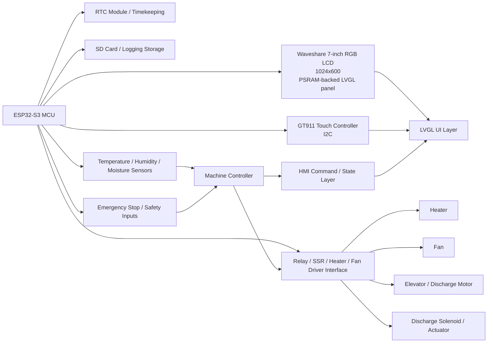

# Rice Dryer HMI Firmware

Independent ESP-IDF firmware for the Waveshare ESP32-S3-Touch-LCD-7B rice dryer HMI.

The implementation is organized around the prompt in [Documentation/Prompt.txt](Documentation/Prompt.txt). The material in [Documentation/16_LVGL_UI](Documentation/16_LVGL_UI) is treated as reference and is not copied into the project build.

## Current status

The project is now at a verified buildable state and has a working foundation for the prompt-driven HMI architecture.

### Implemented foundation

- ESP-IDF 5.5.4 targeting ESP32-S3
- LVGL 8.4.0 through the ESP-IDF managed component
- 1024x600 RGB565 display runtime with PSRAM framebuffers
- GT911 touch input integration and LVGL registration
- Dedicated UI manager and screen navigation layer
- HMI command queue and machine-controller boundary
- HMI state model with shared settings and runtime values
- Settings validation and configuration state handling
- Calibration, RTC, fault, history, and diagnostics support modules
- Home, Drying, and Manual screen logic in the current screen manager

### Verified build evidence

This repository was successfully built with the ESP-IDF toolchain in the current workspace:

```powershell
& 'C:\esp\v5.5.4\esp-idf\export.ps1'; cd 'C:\Thesis Files\Hybrid-Portable-Rice-Drying-Machine'; idf.py build
```

Result: build succeeded and produced `build/rice_dryer_hmi.bin`.

## Project structure

- `main/board`: board startup, LVGL runtime, and touch boundary
- `main/hmi`: HMI state, commands, settings, calibration, RTC, faults, history, diagnostics, and screen manager
- `main/machine`: machine controller safety and state transitions
- `main/storage`: reserved for persistent storage and future RTC/SD integration
- `Documentation`: prompt and reference documentation
- `memory.md`: phased status, decisions, and implementation history
## Wiring diagram (conceptual)

> This is a design-level wiring reference for the rice dryer HMI. The exact pin mapping should be confirmed against the Waveshare board documentation and the final hardware revision before fabrication or deployment.


## Build

From the repository root in an activated ESP-IDF 5.5.4 shell:

```powershell
idf.py set-target esp32s3
idf.py build
idf.py size
```

The current verified environment uses the ESP32-S3 target, the installed ESP-IDF 5.5.4 toolchain, and the generated project binary in the build directory.

## Current limitations

- The project has not yet been flashed and validated on the physical Waveshare panel.
- Dedicated LVGL screens for Settings, Calibration, RTC, Alarms, History, and Diagnostics are not fully implemented as complete UI workflows yet.
- Actual sensor drivers, RTC persistence, SD logging, backlight/reset handling, and real actuator wiring remain pending.
- Actuator drive commands remain safety-interlocked and are not connected to real hardware.

See [memory.md](memory.md) for the detailed phased implementation record and the remaining work order.
